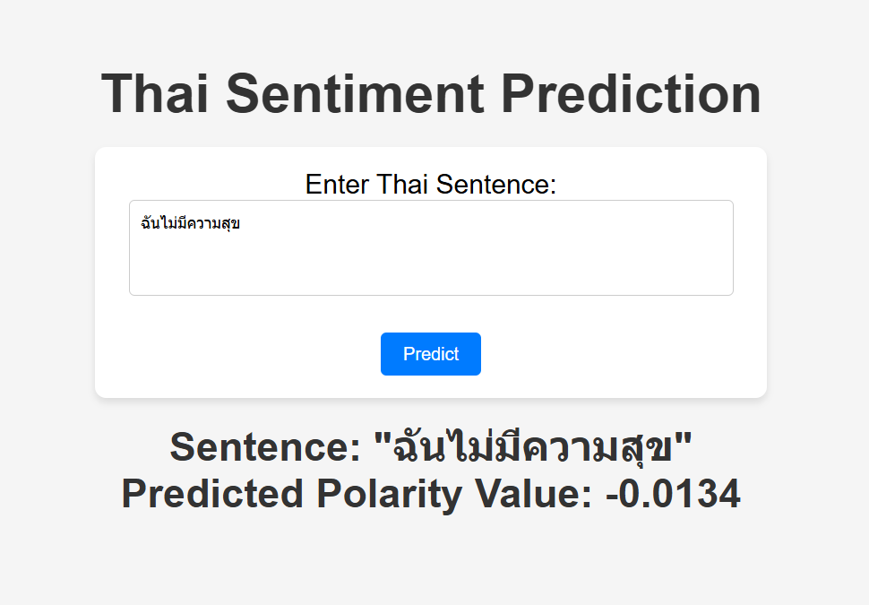

# โปรเจกต์วิเคราะห์อารมณ์ภาษาไทย

โปรเจกต์นี้เป็นเครื่องมือวิเคราะห์อารมณ์ของข้อความภาษาไทย โดยใช้ Linear Regression และ TensorFlow ช่วยพยากรณ์ค่า Polarity (บอกว่าสิ่งที่พูดมีอารมณ์บวกหรือลบ) จากฟีเจอร์ของ SenticNet



### ไฟล์ที่ควรรู้จัก

- **`app.py`**: ไฟล์สำหรับรัน API เพื่อพยากรณ์ค่า Polarity
- **`index.html`**: หน้าเว็บให้เราใส่ข้อความภาษาไทย
- **`styles.css`**: ไฟล์สำหรับจัดการความสวยงามของหน้าเว็บ
- **`SenticNet2_Thai.txt`**: ไฟล์ข้อมูลคำในภาษาไทยพร้อมฟีเจอร์ SenticNet
- **`thai_sentiment_model.npz`**: โมเดลที่ผ่านการฝึกมาแล้ว
- **`train_thai_sentiment_model.ipynb`**: ไฟล์ Jupyter Notebook สำหรับฝึกโมเดล
- **`requirements.txt`**: รายการไลบรารีที่โปรเจกต์นี้ต้องการ
- **`.gitignore`**: ไฟล์สำหรับบอกว่าไฟล์ไหนไม่ต้องติดตามใน Git

## วิธีการใช้งานโปรเจกต์

1. **ติดตั้ง Python และสร้าง Virtual Environment**

   - ถ้ายังไม่มี Python ดาวน์โหลดและติดตั้ง [Python](https://www.python.org/downloads/)
   - เปิด Terminal แล้วรันคำสั่งนี้เพื่อสร้าง Virtual Environment:
     ```bash
     python -m venv env
     ```
   - เปิดใช้งาน Virtual Environment:
     ```bash
     source env/bin/activate  # สำหรับ macOS/Linux
     env\Scripts\activate   # สำหรับ Windows
     ```

2. **ติดตั้งไลบรารีที่ต้องใช้**

   - รันคำสั่ง:
     ```bash
     pip install -r requirements.txt
     ```

3. **รัน API เพื่อพยากรณ์ข้อความ**

   - รันไฟล์ `app.py` ด้วยคำสั่ง:
     ```bash
     python app.py
     ```
   - API จะเริ่มรันที่ `http://localhost:5000`

4. **เปิดหน้าเว็บสำหรับใช้งาน**

   - เปิดไฟล์ `index.html` ในเบราว์เซอร์ (เช่น Chrome หรือ Firefox)
   - จะเจอหน้าที่ให้ใส่ข้อความภาษาไทยเพื่อพยากรณ์ค่าอารมณ์

5. **พยากรณ์ข้อความ**

   - ใส่ข้อความภาษาไทยในช่อง เช่น:
     ```
     ฉันมีความสุขมาก
     ```
   - กดปุ่ม **Predict** แล้วระบบจะแสดงผลลัพธ์ เช่น:
     ```
     Sentence: "ฉันไม่มีความสุข"
     Predicted Polarity Value: -0.0134
     ```

6. **(ถ้าต้องการ) ฝึกโมเดลใหม่**
   - เปิดไฟล์ `train_thai_sentiment_model.ipynb` ใน Jupyter Notebook
   - รันทุกเซลล์เพื่อตั้งค่าและฝึกโมเดลใหม่
   - หลังจากฝึกเสร็จ โมเดลใหม่จะถูกบันทึกในไฟล์ `thai_sentiment_model.npz`

## ตัวอย่างการใช้งาน

### Input:

```
ประโยค: "ฉันไม่มีความสุข"
```

### Output:

```
Predicted Polarity: -0.0134
```

## หมายเหตุ

- ฟีเจอร์ของคำในประโยคจะถูกคำนวณจากไฟล์ `SenticNet2_Thai.txt`
- หากคำในประโยคไม่มีในไฟล์นี้ ระบบจะกำหนดค่าเริ่มต้นเป็น 0
- โปรเจกต์นี้สำหรับฝึกและศึกษาเท่านั้น ผลลัพธ์ที่ได้อาจจะมีผิดพลาด
